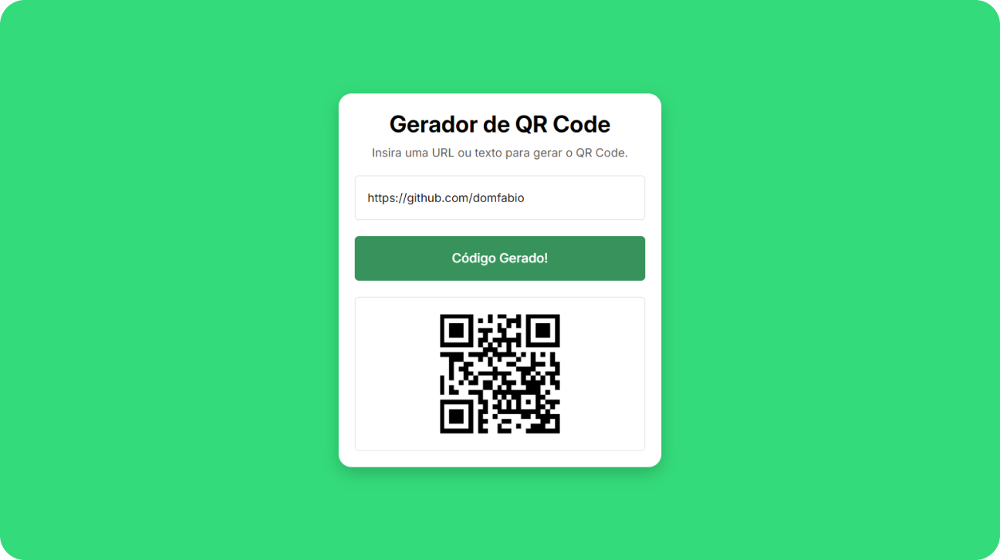

# 🧩 Gerador de QR Code (JavaScript + API)

 

    <h2>🎯 Sobre o Projeto</h2>
    Este é o segundo projeto com <strong>JavaScript</strong>, focado em gerar QR Code dinamicamente via <strong>API</strong>. A aplicação permite criar QR Code de forma interativa com base nos dados fornecidos pelos usuários.

 

## 👨🏾‍💻 Desafio do Projeto
 
A aplicação gera QR Code dinamicamente usando uma API externa e atualiza a interface com base nas interações do usuário. Iserindo a URL ou texto e ao clicar no botão ou pressionar "Enter", o valor é enviado para a API, exibindo o QR Code.

 

## 📸 Screenshots

 

## 🏆 Aprendizados 

- Integração com API
- Eventos do Teclado e Botão
- Atualização Dinâmica
- Limpeza Automática

 

## 🚀 Tecnologias Utilizadas

- API
- JavaScript (ES6)
- HTML5
- CSS3

 

## 🔗 Projeto On-line
Este projeto está disponível para visualização on-line.  
Você pode acessá-lo através do link: https://tabuada-com-java-script.vercel.app/

 

##

    Este projeto foi desenvolvido como parte do curso <strong>Formação Front-end - HTML, CSS, JavaScript, React e +</strong>, ministrado por <strong>Matheus Battisti</strong> da Escola de Programação <strong>🕒 Hora de Codar</strong>.

